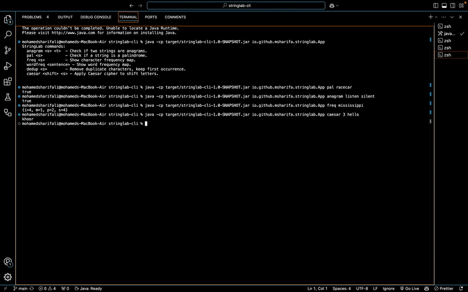

[](LICENSE)


# StringLab CLI

A simple Java **command-line toolkit** for string operations.  
Built as a learning project to practice Java fundamentals, collections, and CLI argument parsing.

## Features
- **Anagram Check** — `anagram <s> <t>`  
- **Palindrome Check** — `pal <s>`  
- **Character Frequency** — `freq <s>`  
- **Word Frequency** — `wordfreq "<sentence>"`  
- **Remove Duplicate Characters** — `dedup <s>`  
- **Caesar Cipher Encryption** — `caesar <shift> <s>`  
- **Caesar Cipher Decryption** — `decrypt <shift> <s>`  
- **Caesar Cipher Bruteforce** — `bruteforce <s>`

---

## Installation

### Requirements
- **Java 17+**
- **Maven 3.8+**

### Clone and Build
```bash
git clone https://github.com/<your-username>/stringlab-cli.git
cd stringlab-cli
mvn package
````

---

## Usage

Run the JAR directly from `target/`:

```bash
java -cp target/stringlab-cli-1.0-SNAPSHOT.jar io.github.msharifa.stringlab.App <command> [args...]
```

### Examples

```bash
# Check if two words are anagrams
java -cp target/stringlab-cli-1.0-SNAPSHOT.jar io.github.msharifa.stringlab.App anagram listen silent
# -> true

# Palindrome check
java -cp target/stringlab-cli-1.0-SNAPSHOT.jar io.github.msharifa.stringlab.App pal racecar
# -> true

# Character frequency
java -cp target/stringlab-cli-1.0-SNAPSHOT.jar io.github.msharifa.stringlab.App freq mississippi
# -> {i=4, m=1, p=2, s=4}

# Word frequency
java -cp target/stringlab-cli-1.0-SNAPSHOT.jar io.github.msharifa.stringlab.App wordfreq "Apple banana apple orange banana apple"
# -> {apple=3, banana=2, orange=1}

# Remove duplicate characters
java -cp target/stringlab-cli-1.0-SNAPSHOT.jar io.github.msharifa.stringlab.App dedup mississippi
# -> misp

# Caesar cipher encryption (+3)
java -cp target/stringlab-cli-1.0-SNAPSHOT.jar io.github.msharifa.stringlab.App caesar 3 hello
# -> khoor

# Caesar cipher decryption (-3)
java -cp target/stringlab-cli-1.0-SNAPSHOT.jar io.github.msharifa.stringlab.App decrypt 3 khoor
# -> hello

# Bruteforce Caesar cipher
java -cp target/stringlab-cli-1.0-SNAPSHOT.jar io.github.msharifa.stringlab.App bruteforce khoor
# -> prints all 26 shift possibilities
```

---

## 🛠 Development

### Project Structure

```
src/
  main/java/io/github/msharifa/stringlab/   # CLI & logic
  test/java/io/github/msharifa/stringlab/   # Unit tests (future)
pom.xml                                     # Maven config
```

### Build

```bash
mvn clean package
```

---

## 📜 License

This project is licensed under the MIT License 

